# AB LEARNING — ER Diagram (V1)

Covers all 45 entities from the source spec, grouped by domain. Rendered as Mermaid `erDiagram` — paste into any Mermaid-compatible viewer (mermaid.live, Notion, or a Mermaid Figma plugin) to visualize. Full DDL matching this diagram is in `04-schema.sql`.

## Domain map

| Domain | Entities |
|---|---|
| Identity | users, profiles, roles |
| Catalog | categories, courses, course_sections, lessons, instructors |
| Learning | enrollments, lesson_progress, quizzes, quiz_questions, quiz_attempts, certificates |
| Commerce | orders, order_items, payments, coupons, refunds |
| Live | live_sessions, live_attendees, live_questions |
| Community | communities, community_posts, comments, likes |
| Career | skills, skill_assessments, skill_results, career_paths, career_path_skills, portfolios, portfolio_projects |
| Jobs | jobs, job_applications, employers |
| Corporate | organizations, organization_users, learning_paths, learning_path_courses |
| Platform | notifications, wallets, wallet_transactions, subscriptions, creator_payouts, reviews, reports, audit_logs |

## Diagram

```mermaid
erDiagram
  %% Entities with key fields (PK: id)
  USERS {
    string id PK
    string email
    string password_hash
    string role_id FK
    datetime created_at
  }

  PROFILES {
    string id PK
    string user_id FK
    string display_name
    string bio
    string avatar_url
  }

  ROLES {
    string id PK
    string code
    string name
  }

  COURSES {
    string id PK
    string instructor_id FK
    string category_id FK
    string title
    decimal price
    string status
  }

  COURSE_SECTIONS {
    string id PK
    string course_id FK
    string title
    int position
  }

  LESSONS {
    string id PK
    string section_id FK
    string title
    int duration_seconds
  }

  ENROLLMENTS {
    string id PK
    string user_id FK
    string course_id FK
    string status
    decimal progress
  }

  LESSON_PROGRESS {
    string id PK
    string enrollment_id FK
    string lesson_id FK
    decimal watched_seconds
  }

  QUIZZES {
    string id PK
    string course_id FK
    string title
  }

  QUIZ_QUESTIONS {
    string id PK
    string quiz_id FK
    string question
  }

  QUIZ_ATTEMPTS {
    string id PK
    string quiz_id FK
    string user_id FK
    int score
  }

  ORDERS {
    string id PK
    string user_id FK
    decimal total_amount
    string status
  }

  ORDER_ITEMS {
    string id PK
    string order_id FK
    string course_id FK
    decimal price
  }

  PAYMENTS {
    string id PK
    string order_id FK
    string method
    decimal amount
    string status
  }

  REFUNDS {
    string id PK
    string payment_id FK
    decimal amount
    string reason
  }

  LIVE_SESSIONS {
    string id PK
    string course_id FK
    string title
    datetime start_at
  }

  LIVE_ATTENDEES {
    string id PK
    string live_session_id FK
    string user_id FK
  }

  COMMUNITY_POSTS {
    string id PK
    string user_id FK
    string content
    datetime posted_at
  }

  COMMENTS {
    string id PK
    string post_id FK
    string user_id FK
    string content
  }

  LIKES {
    string id PK
    string post_id FK
    string user_id FK
  }

  SKILLS {
    string id PK
    string name
  }

  SKILL_ASSESSMENTS {
    string id PK
    string user_id FK
    string skill_id FK
    int score
  }

  SKILL_RESULTS {
    string id PK
    string assessment_id FK
    string summary_json
  }

  CAREER_PATHS {
    string id PK
    string title
  }

  CAREER_PATH_SKILLS {
    string id PK
    string career_path_id FK
    string skill_id FK
  }

  PORTFOLIOS {
    string id PK
    string user_id FK
    string headline
  }

  PORTFOLIO_PROJECTS {
    string id PK
    string portfolio_id FK
    string title
  }

  JOBS {
    string id PK
    string employer_id FK
    string title
    string location
  }

  JOB_APPLICATIONS {
    string id PK
    string job_id FK
    string user_id FK
    string status
  }

  ORGANIZATIONS {
    string id PK
    string name
  }

  ORGANIZATION_USERS {
    string id PK
    string organization_id FK
    string user_id FK
    string department
  }

  LEARNING_PATHS {
    string id PK
    string organization_id FK
    string title
  }

  LEARNING_PATH_COURSES {
    string id PK
    string learning_path_id FK
    string course_id FK
  }

  WALLETS {
    string id PK
    string user_id FK
    decimal balance
  }

  WALLET_TRANSACTIONS {
    string id PK
    string wallet_id FK
    decimal amount
    string type
  }

  CREATOR_PAYOUTS {
    string id PK
    string instructor_id FK
    decimal amount
    string status
  }

  REVIEWS {
    string id PK
    string course_id FK
    string user_id FK
    int rating
    string comment
  }

  AUDIT_LOGS {
    string id PK
    string user_id FK
    string action
    datetime created_at
  }

  %% Relationships
  USERS ||--o| PROFILES : has
  USERS }o--|| ROLES : assigned
  USERS ||--o{ ENROLLMENTS : enrolls
  ENROLLMENTS ||--o{ LESSON_PROGRESS : tracks
  COURSES ||--o{ COURSE_SECTIONS : contains
  COURSE_SECTIONS ||--o{ LESSONS : contains
  COURSES ||--o{ QUIZZES : has
  QUIZZES ||--o{ QUIZ_QUESTIONS : contains
  QUIZZES ||--o{ QUIZ_ATTEMPTS : attempts
  USERS ||--o{ ORDERS : places
  ORDERS ||--o{ ORDER_ITEMS : contains
  ORDER_ITEMS }o--|| COURSES : references
  ORDERS ||--o| PAYMENTS : paid_via
  PAYMENTS ||--o{ REFUNDS : may_have
  COURSES ||--o{ LIVE_SESSIONS : schedules
  LIVE_SESSIONS ||--o{ LIVE_ATTENDEES : has
  COMMUNITY_POSTS ||--o{ COMMENTS : has
  COMMUNITY_POSTS ||--o{ LIKES : receives
  SKILLS ||--o{ SKILL_ASSESSMENTS : measured_by
  SKILL_ASSESSMENTS ||--o{ SKILL_RESULTS : produces
  CAREER_PATHS ||--o{ CAREER_PATH_SKILLS : requires
  PORTFOLIOS ||--o{ PORTFOLIO_PROJECTS : contains
  JOBS ||--o{ JOB_APPLICATIONS : receives
  ORGANIZATIONS ||--o{ ORGANIZATION_USERS : employs
  ORGANIZATIONS ||--o{ LEARNING_PATHS : defines
  LEARNING_PATHS ||--o{ LEARNING_PATH_COURSES : includes
  WALLETS ||--o{ WALLET_TRANSACTIONS : logs
  INSTRUCTORS ||--o{ CREATOR_PAYOUTS : receives
  COURSES ||--o{ REVIEWS : receives
```

## Key design notes

- `users` is the single identity table; `roles` is a lookup (`LEARNER`, `INSTRUCTOR`, `CORP_ADMIN`, `CORP_MANAGER`, `EMPLOYER`, `ADMIN`) referenced by a `role_id` FK on `users` — matches the role matrix in §01.1 of the spec. A user can hold exactly one primary role plus optional secondary capability flags (e.g. a `LEARNER` who is also an `INSTRUCTOR`) — modeled via the separate `instructors` table keyed to `user_id`, not a second role row.
- `enrollments` is the join between `users` and `courses` and is the anchor for `lesson_progress` and `certificates` — a certificate cannot exist without a completed enrollment.
- `orders` → `order_items` → `payments` mirrors a standard commerce flow; `refunds` hangs off `payments`, not `orders`, since a partial refund is a payment-level event.
- `organization_users` is the corporate join table (`organizations` ↔ `users`) and carries `department`, `role_in_org`, `status` — this is what screens 36–38 query.
- `skill_results` is derived/denormalized from `skill_assessments` (one assessment attempt → one result snapshot) so Career Path (24) can read a fast summary without recomputing from raw answers.
